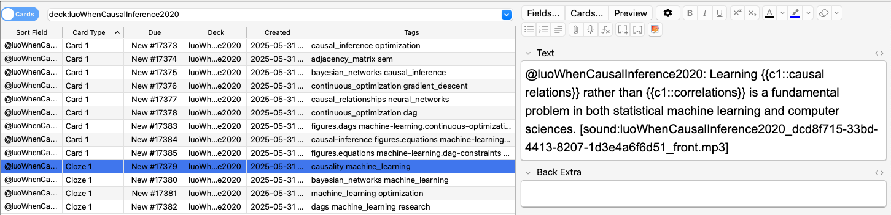

# Fix Cloze Cards

## Goal

We are trying to fix the complementary audio for cloze cards. Currently the audio reads the cards and masks out the hidden words (clozed text) by saying "blank" in it's place. Then when we flip the card we want to play the audio with the words. The issue is that the audio for the back of the card is not being sent. We believe this is due to cloze cards not having a back field.

## AnkiConnect Relevant Data

<https://git.sr.ht/~foosoft/anki-connect>

We see here that the Cloze cards have Text and Extra Fields.

```json
guiAddCards
Invokes the Add Cards dialog, presets the note using the given deck and model, with the provided field values and tags. Invoking it multiple times closes the old window and reopen the window with the new provided values.

Audio, video, and picture files can be embedded into the fields via the audio, video, and picture keys, respectively. Refer to the documentation of addNote and storeMediaFile for an explanation of these fields.

The result is the ID of the note which would be added, if the user chose to confirm the Add Cards dialogue.

Sample request:
{
    "action": "guiAddCards",
    "version": 6,
    "params": {
        "note": {
            "deckName": "Default",
            "modelName": "Cloze",
            "fields": {
                "Text": "The capital of Romania is {{c1::Bucharest}}",
                "Extra": "Romania is a country in Europe"
            },
            "tags": [
              "countries"
            ],
            "picture": [{
                "url": "https://upload.wikimedia.org/wikipedia/commons/thumb/1/13/EU-Romania.svg/285px-EU-Romania.svg.png",
                "filename": "romania.png",
                "fields": [
                    "Extra"
                ]
            }]
        }
    }
}
Sample result:
```

This differs from basic cards where we have Front and Back fields.

```json
{
    "result": {
        "answer": "back content",
        "question": "front content",
        "deckName": "Default",
        "modelName": "Basic",
        "fieldOrder": 0,
        "fields": {
            "Front": {"value": "front content", "order": 0},
            "Back": {"value": "back content", "order": 1}
        },
        "template": "Forward",
        "cardId": 1498938915662,
        "buttons": [1, 2, 3],
        "nextReviews": ["<1m", "<10m", "4d"]
    },
    "error": null
}
```

We still want to use % delimiter to separate front from back. The only real difference is that for a basic card we use `Front` and `Back` and for cloze we use `Text` and `Extra`. We will need to detect card type to be able to properly send data to Anki.

## Example Card in MD

```markdown
## @luoWhenCausalInference2020: Learning {{c1::causal relations}} rather than {{c1::correlations}} is a fundamental problem in both statistical machine learning and computer sciences.

[audio-front](gen-md-complementary-audio/luoWhenCausalInference2020_dcd8f715-33bd-4413-8207-1d3e4a6f6d51_front.mp3)
 % 
[audio-back](gen-md-complementary-audio/luoWhenCausalInference2020_dcd8f715-33bd-4413-8207-1d3e4a6f6d51_back.mp3)
```

#machine_learning, #causality

Data once sent to Anki



## Relevant Files

We think that the issues are probably related these files:

- swanki/processing/anki_processor.py
  - We think that we are probably send data to wrong fields.

## Relevant Command

```python
swanki pdf_path=/Users/michaelvolk/Documents/projects/Swanki/Luo_2020.pdf citation_key=luoWhenCausalInference2020 audio=full anki=auto_send
```

## Code Structure

```bash
(swanki) michaelvolk@M1-MV Swanki % tree /Users/michaelvolk/Documents/projects/Swanki/swanki -L 2                                     17:09
/Users/michaelvolk/Documents/projects/Swanki/swanki
├── __init__.py
├── __main__.py
├── __pycache__
│   ├── __init__.cpython-311.pyc
│   ├── __main__.cpython-311.pyc
│   ├── clean_md.cpython-311.pyc
│   ├── clean_transcript.cpython-311.pyc
│   ├── combine_pdf.cpython-311.pyc
│   ├── combine.cpython-311.pyc
│   ├── cut.cpython-311.pyc
│   ├── first_module.cpython-311.pyc
│   ├── generate_cards_with_complementary_audio.cpython-311.pyc
│   ├── generate_cards.cpython-311.pyc
│   ├── generate_complementary_audio_gen_md.cpython-311.pyc
│   ├── generate_complementary_audio_transcript_gen_md.cpython-311.pyc
│   ├── generate_complementary_audio_transcript_image_cards.cpython-311.pyc
│   ├── generate_image_cards_with_complementary_audio.cpython-311.pyc
│   ├── generate_image_cards.cpython-311.pyc
│   ├── generate_reading_transcript.cpython-311.pyc
│   ├── generate_transcript.cpython-311.pyc
│   ├── image_summary_replace.cpython-311.pyc
│   ├── mathpix.cpython-311.pyc
│   ├── md_to_anki.cpython-311.pyc
│   ├── recombine_md.cpython-311.pyc
│   ├── send_to_anki.cpython-311.pyc
│   ├── split_pdf.cpython-311.pyc
│   ├── token_count.cpython-311.pyc
│   └── transcript_to_audio.cpython-311.pyc
├── __version__.py
├── config
│   ├── __init__.py
│   ├── __pycache__
│   └── generator.py
├── cut.py
├── legacy
│   ├── __init__.py
│   ├── __main__legacy.py
│   ├── __pycache__
│   ├── clean_md.py
│   ├── clean_transcript.py
│   ├── combine_pdf.py
│   ├── combine.py
│   ├── cut.py
│   ├── extract_jpg_links.py
│   ├── generate_cards_with_complementary_audio.py
│   ├── generate_cards.py
│   ├── generate_complementary_audio_gen_md.py
│   ├── generate_complementary_audio_image_cards.py
│   ├── generate_complementary_audio_transcript_gen_md.py
│   ├── generate_complementary_audio_transcript_image_cards.py
│   ├── generate_image_cards_with_complementary_audio.py
│   ├── generate_image_cards.py
│   ├── generate_reading_transcript.py
│   ├── generate_transcript.py
│   ├── get_cards_ankiconnect.py
│   ├── image_add_back.py
│   ├── image_reader.py
│   ├── image_summary_insert.py
│   ├── image_summary_replace.py
│   ├── mathpix.py
│   ├── md_to_anki.py
│   ├── podcast_test.py
│   ├── recombine_md.py
│   ├── split_pdf.py
│   ├── token_count.py
│   └── transcript_to_audio.py
├── models
│   ├── __init__.py
│   ├── __pycache__
│   ├── audio.py
│   ├── cards.py
│   ├── document.py
│   └── pipeline.py
├── pipeline
│   ├── __init__.py
│   ├── __pycache__
│   └── pipeline.py
├── processing
│   ├── __init__.py
│   ├── __pycache__
│   ├── anki_processor.py
│   ├── image_processor.py
│   ├── markdown_cleaner.py
│   ├── markdown_converter.py
│   └── pdf_processor.py
├── send_to_anki.py
└── utils
    ├── __init__.py
    ├── __pycache__
    ├── audio.py
    ├── content.py
    └── formatting.py

14 directories, 79 files
```

## Tasks

- [ ] Make changes so that the audio files that we have for back of cloze cards go to extra fields. I will rerun our test card creation and go through cards in Anki and report back.
