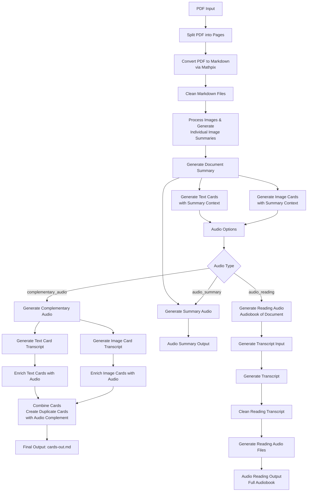

# PDF-to-Cards System Refactor Implementation Plan (Revised with Hydra)

## Overview

Weekend sprint refactor focusing on:

- **Hydra Configuration**: Flexible, user-customizable pipeline with auto-generated defaults
- **Structured Output**: Migrate to `instructor` library with Pydantic models
- **Context-Aware Processing**: Summary-first approach for better card/audio quality
- **User Control**: Multiple configurable outputs via Hydra

## System Architecture

### Main Pipeline Flow



## Hydra Configuration System

### Auto-Generated Default Configuration Structure

```python
# swanki/config_generator.py
from pathlib import Path
import yaml
from typing import Dict, Any

class ConfigGenerator:
    """Auto-generates default Hydra configs if not present"""
    
    DEFAULT_CONFIG_DIR = Path.home() / ".swanki_config"
    
    @classmethod
    def ensure_configs(cls) -> Path:
        """Ensure config directory exists with all defaults"""
        config_dir = cls.DEFAULT_CONFIG_DIR
        
        if not config_dir.exists():
            print(f"Creating default configs at {config_dir}")
            config_dir.mkdir(parents=True, exist_ok=True)
            cls._generate_all_defaults(config_dir)
        
        return config_dir
    
    @classmethod
    def _generate_all_defaults(cls, config_dir: Path):
        """Generate all default configuration files"""
        
        # Main config
        cls._write_yaml(config_dir / "config.yaml", {
            "defaults": [
                "_self_",
                "pipeline: default",
                "prompts: default", 
                "models: default",
                "audio: default",
                "output: default"
            ],
            "hydra": {
                "run": {
                    "dir": "outputs/${now:%Y-%m-%d}/${now:%H-%M-%S}"
                }
            }
        })
        
        # Pipeline configs
        pipeline_dir = config_dir / "pipeline"
        pipeline_dir.mkdir(exist_ok=True)
        
        cls._write_yaml(pipeline_dir / "default.yaml", {
            "processing": {
                "window_size": 2,
                "skip": 1,
                "num_cards_per_page": 3,
                "chunk_size": 1000,
                "overlap": 200,
                "blocking_audio": True  # Based on learnings
            }
        })
        
        cls._write_yaml(pipeline_dir / "comprehensive.yaml", {
            "processing": {
                "window_size": 3,
                "skip": 1,
                "num_cards_per_page": 5,
                "chunk_size": 1500,
                "overlap": 300,
                "blocking_audio": True
            }
        })
        
        cls._write_yaml(pipeline_dir / "fast.yaml", {
            "processing": {
                "window_size": 1,
                "skip": 1,
                "num_cards_per_page": 2,
                "chunk_size": 800,
                "overlap": 100,
                "blocking_audio": False
            }
        })
        
        # Prompts configs
        prompts_dir = config_dir / "prompts"
        prompts_dir.mkdir(exist_ok=True)
        
        cls._write_yaml(prompts_dir / "default.yaml", {
            "prompts": {
                "summary": {
                    "system": "You are an expert at creating concise, informative summaries of academic documents.",
                    "document_summary": """Create a comprehensive summary of this document.
Focus on:
1. Main thesis and key contributions
2. All acronyms and their full forms
3. Technical terms that need clear definitions
4. Methodology and approach
5. Key findings

Document content:
{content}

Image summaries:
{image_summaries}""",
                    "image_summary": """Describe this image in 2-3 sentences.
Focus on what information it conveys and its relevance.
If it contains equations or data, describe them clearly."""
                },
                "cards": {
                    "system": "You are an expert at creating educational flashcards that test understanding.",
                    "generate_cards": """Create {num_cards} flashcards from this content.

Context from document summary:
Title: {title}
Acronyms: {acronyms}
Technical terms: {technical_terms}

Content:
{content}

Rules:
1. Each card tests ONE concept
2. Use full forms of acronyms in answers
3. Make questions clear and specific
4. Answers should be comprehensive but concise"""
                },
                "audio": {
                    "transcript_cleaning": """Convert this text to be TTS-friendly:
1. Expand acronyms on first use
2. Convert math notation to words
3. Add pronunciation guides for technical terms
4. Ensure citation key is read at start of card

Text: {text}
Citation key: {citation_key}
Known acronyms: {acronyms}"""
                }
            }
        })
        
        cls._write_yaml(prompts_dir / "technical.yaml", {
            "prompts": {
                "summary": {
                    "system": "You are an expert in technical and scientific literature.",
                    "document_summary": """Create a technical summary focusing on:
1. Mathematical formulations
2. Algorithm descriptions
3. Technical acronyms and notation
4. Implementation details
5. Experimental setup

{content}"""
                }
            }
        })
        
        # Models configs
        models_dir = config_dir / "models"
        models_dir.mkdir(exist_ok=True)
        
        cls._write_yaml(models_dir / "default.yaml", {
            "models": {
                "llm": {
                    "provider": "openai",
                    "model": "gpt-4",
                    "temperature": 0.7,
                    "max_retries": 3
                },
                "tts": {
                    "provider": "elevenlabs",
                    "voice_id": "21m00Tcm4TlvDq8ikWAM",  # Rachel
                    "model": "eleven_monolingual_v1",
                    "stability": 0.5,
                    "similarity_boost": 0.5
                }
            }
        })
        
        cls._write_yaml(models_dir / "openai_tts.yaml", {
            "models": {
                "tts": {
                    "provider": "openai",
                    "voice": "nova",
                    "model": "tts-1-hd",
                    "speed": 1.0
                }
            }
        })
        
        # Audio configs
        audio_dir = config_dir / "audio"
        audio_dir.mkdir(exist_ok=True)
        
        cls._write_yaml(audio_dir / "default.yaml", {
            "audio": {
                "generate_complementary": True,
                "generate_summary": True,
                "generate_reading": False,
                "complementary_speed": 1.0,
                "summary_speed": 1.1,
                "reading_speed": 1.2,
                "format": "mp3",
                "quality": "high"
            }
        })
        
        cls._write_yaml(audio_dir / "minimal.yaml", {
            "audio": {
                "generate_complementary": True,
                "generate_summary": False,
                "generate_reading": False
            }
        })
        
        cls._write_yaml(audio_dir / "full.yaml", {
            "audio": {
                "generate_complementary": True,
                "generate_summary": True,
                "generate_reading": True
            }
        })
        
        # Output configs
        output_dir = config_dir / "output"
        output_dir.mkdir(exist_ok=True)
        
        cls._write_yaml(output_dir / "default.yaml", {
            "output": {
                "base_dir": "swanki-out",
                "formats": {
                    "cards_plain": "cards-plain.md",
                    "cards_audio": "cards-with-audio.md",
                    "cards_combined": "cards-combined.md",
                    "summary": "document-summary.md"
                },
                "organize_by_type": True,
                "create_anki_deck": False
            }
        })
    
    @staticmethod
    def _write_yaml(path: Path, data: Dict[str, Any]):
        """Write YAML file with nice formatting"""
        with open(path, 'w') as f:
            yaml.dump(data, f, default_flow_style=False, sort_keys=False)
```

### Hydra Integration in Main Script

```python
# swanki/__main__.py
import hydra
from hydra import compose, initialize_config_dir
from omegaconf import DictConfig, OmegaConf
from pathlib import Path
from swanki.config_generator import ConfigGenerator
from swanki.pipeline import Pipeline

@hydra.main(version_base=None, config_path=None, config_name="config")
def main(cfg: DictConfig) -> None:
    """Main entry point with Hydra configuration"""
    
    # Convert to regular dict for easier use
    config = OmegaConf.to_container(cfg, resolve=True)
    
    # Initialize pipeline with config
    pipeline = Pipeline(config)
    
    # Process based on command line args
    if cfg.pdf_path:
        outputs = pipeline.process_full(
            pdf_path=Path(cfg.pdf_path),
            citation_key=cfg.citation_key
        )
        print(f"Generated outputs: {outputs}")
    else:
        print("No PDF provided. Use --pdf_path=path/to/file.pdf")

def cli_main():
    """CLI entry point that ensures configs exist"""
    # Ensure default configs exist
    config_dir = ConfigGenerator.ensure_configs()
    
    # Initialize Hydra with user's config directory
    initialize_config_dir(config_dir=str(config_dir), version_base=None)
    
    # Run main with Hydra
    main()

if __name__ == "__main__":
    cli_main()
```

## Updated Data Models with Config Integration

```python
# swanki/models.py
from pydantic import BaseModel, Field, field_validator
from typing import List, Optional, Dict, Any, Literal
from pathlib import Path

class ImageSummary(BaseModel):
    """Structured image summary output"""
    page_idx: int
    image_url: str
    summary: str = Field(..., description="2-3 sentence description")
    extracted_text: Optional[str] = Field(None, description="Any text/equations in image")
    
    @field_validator('summary')
    def summary_length(cls, v):
        """Ensure summary is concise"""
        words = len(v.split())
        if words > 100:
            raise ValueError(f"Summary too long: {words} words")
        return v

class DocumentSummary(BaseModel):
    """Structured document summary with key information"""
    title: str
    authors: List[str]
    main_topic: str
    key_contributions: List[str] = Field(..., max_length=5)
    methodology: str
    acronyms: Dict[str, str] = Field(default_factory=dict, description="Acronym definitions")
    technical_terms: Dict[str, str] = Field(default_factory=dict, description="Technical term definitions")
    summary: str = Field(..., description="200-500 word summary")
    
    @field_validator('summary')
    def summary_length(cls, v):
        words = len(v.split())
        if not 200 <= words <= 500:
            raise ValueError(f"Summary should be 200-500 words, got {words}")
        return v

class CardContent(BaseModel):
    """Structured content for a card side"""
    text: str = Field(..., min_length=1, max_length=500)
    requires_latex: bool = Field(default=False)
    audio_hint: Optional[str] = Field(None, description="Pronunciation guide for TTS")

class PlainCard(BaseModel):
    """Structured flashcard output"""
    front: CardContent
    back: CardContent
    tags: List[str] = Field(default_factory=list)
    difficulty: Literal["easy", "medium", "hard"] = "medium"
    
    def add_citation_prefix(self, citation_key: str):
        """Add citation key to front of card"""
        if citation_key and not self.front.text.startswith(citation_key):
            self.front.text = f"{citation_key}: {self.front.text}"
    
    def to_md(self, include_audio: bool = False, audio_uri: Optional[str] = None) -> str:
        """Convert to markdown with optional audio"""
        md = f"## Card\n\n"
        md += f"**Q:** {self.front.text}\n\n"
        md += f"**A:** {self.back.text}\n\n"
        if include_audio and audio_uri:
            md += f"**Audio:** [{audio_uri}]({audio_uri})\n\n"
        md += f"**Tags:** {', '.join(self.tags)}\n\n"
        md += "---\n\n"
        return md

class CardGenerationResponse(BaseModel):
    """Structured response for card generation"""
    cards: List[PlainCard]
    skipped_sections: List[str] = Field(default_factory=list, description="Sections not suitable for cards")
    
    @field_validator('cards')
    def validate_card_count(cls, v):
        if len(v) == 0:
            raise ValueError("Must generate at least one card")
        return v

class AudioTranscript(BaseModel):
    """Structured audio transcript"""
    citation_key: str
    card_id: str
    content: str
    tts_version: str = Field(..., description="TTS-friendly version with pronunciations")
    
    def get_filename(self) -> str:
        return f"{self.citation_key}_{self.card_id}.txt"

class ProcessingState(BaseModel):
    """Track pipeline processing state"""
    pdf_path: Path
    citation_key: str
    current_stage: str
    document_summary: Optional[DocumentSummary] = None
    cards_generated: int = 0
    audio_files_generated: int = 0
    outputs: Dict[str, Path] = Field(default_factory=dict)
```

## Pipeline Implementation with Hydra Config

```python
# swanki/pipeline.py
from pathlib import Path
from typing import Dict, Any, List
from omegaconf import DictConfig
import instructor
from openai import OpenAI

from .models import (
    DocumentSummary, CardGenerationResponse, 
    ImageSummary, ProcessingState
)

class Pipeline:
    """Main processing pipeline with Hydra configuration"""
    
    def __init__(self, config: Dict[str, Any]):
        self.config = config
        self.instructor = instructor.patch(OpenAI())
        self.state = None
        
    def process_full(self, pdf_path: Path, citation_key: str) -> Dict[str, Path]:
        """Process PDF with configuration-driven pipeline"""
        
        # Initialize state
        self.state = ProcessingState(
            pdf_path=pdf_path,
            citation_key=citation_key,
            current_stage="initialization"
        )
        
        # 1. Split PDF based on config
        self.state.current_stage = "pdf_split"
        pages = self.split_pdf(pdf_path)
        
        # 2. Convert to markdown
        self.state.current_stage = "markdown_conversion"
        markdown_files = self.convert_to_markdown(pages)
        
        # 3. Clean markdown
        self.state.current_stage = "markdown_cleaning"
        cleaned_files = self.clean_markdown(markdown_files)
        
        # 4. Process images with configured prompts
        self.state.current_stage = "image_processing"
        image_summaries = self.process_images(
            cleaned_files,
            prompt=self.config['prompts']['summary']['image_summary']
        )
        
        # 5. Generate document summary (EARLY!)
        self.state.current_stage = "summary_generation"
        doc_summary = self.generate_document_summary(
            cleaned_files,
            image_summaries,
            system_prompt=self.config['prompts']['summary']['system'],
            user_prompt=self.config['prompts']['summary']['document_summary']
        )
        self.state.document_summary = doc_summary
        
        # 6. Generate cards with sliding window
        self.state.current_stage = "card_generation"
        all_cards = self.generate_cards_with_window(
            cleaned_files,
            doc_summary,
            window_size=self.config['processing']['window_size'],
            skip=self.config['processing']['skip'],
            num_cards=self.config['processing']['num_cards_per_page']
        )
        
        # 7. Add citation keys
        for card in all_cards:
            card.add_citation_prefix(citation_key)
        
        self.state.cards_generated = len(all_cards)
        
        # 8. Generate outputs based on config
        self.state.current_stage = "output_generation"
        outputs = self.generate_outputs(all_cards, doc_summary)
        
        # 9. Generate audio if configured
        if any([
            self.config['audio']['generate_complementary'],
            self.config['audio']['generate_summary'],
            self.config['audio']['generate_reading']
        ]):
            self.state.current_stage = "audio_generation"
            self.generate_audio(all_cards, doc_summary, outputs)
        
        self.state.outputs = outputs
        return outputs
    
    def generate_cards_with_window(
        self, 
        markdown_files: List[Path],
        doc_summary: DocumentSummary,
        window_size: int,
        skip: int,
        num_cards: int
    ) -> List[PlainCard]:
        """Generate cards using sliding window approach"""
        all_cards = []
        
        for i in range(0, len(markdown_files) - window_size + 1, skip):
            window_files = markdown_files[i:i + window_size]
            
            # Combine content from window
            combined_content = "\n\n".join([
                f.read_text() for f in window_files
            ])
            
            # Generate cards for this window
            response = self.instructor.chat.completions.create(
                model=self.config['models']['llm']['model'],
                messages=[
                    {
                        "role": "system", 
                        "content": self.config['prompts']['cards']['system']
                    },
                    {
                        "role": "user",
                        "content": self.config['prompts']['cards']['generate_cards'].format(
                            num_cards=num_cards * len(window_files),
                            title=doc_summary.title,
                            acronyms=doc_summary.acronyms,
                            technical_terms=doc_summary.technical_terms,
                            content=combined_content
                        )
                    }
                ],
                response_model=CardGenerationResponse,
                max_retries=self.config['models']['llm']['max_retries']
            )
            
            all_cards.extend(response.cards)
        
        return all_cards
    
    def generate_outputs(
        self, 
        cards: List[PlainCard], 
        summary: DocumentSummary
    ) -> Dict[str, Path]:
        """Generate multiple output files based on config"""
        output_dir = Path(self.config['output']['base_dir'])
        output_dir.mkdir(exist_ok=True)
        
        outputs = {}
        
        # Plain cards (no audio)
        plain_path = output_dir / self.config['output']['formats']['cards_plain']
        with open(plain_path, 'w') as f:
            for card in cards:
                f.write(card.to_md(include_audio=False))
        outputs['cards_plain'] = plain_path
        
        # Cards with audio placeholders
        audio_path = output_dir / self.config['output']['formats']['cards_audio']
        with open(audio_path, 'w') as f:
            for i, card in enumerate(cards):
                audio_uri = f"audio/card_{i}.mp3"  # Placeholder
                f.write(card.to_md(include_audio=True, audio_uri=audio_uri))
        outputs['cards_audio'] = audio_path
        
        # Document summary
        summary_path = output_dir / self.config['output']['formats']['summary']
        with open(summary_path, 'w') as f:
            f.write(f"# {summary.title}\n\n")
            f.write(f"**Authors:** {', '.join(summary.authors)}\n\n")
            f.write(f"## Summary\n\n{summary.summary}\n\n")
            f.write(f"## Key Contributions\n\n")
            for contrib in summary.key_contributions:
                f.write(f"- {contrib}\n")
            f.write(f"\n## Acronyms\n\n")
            for acronym, definition in summary.acronyms.items():
                f.write(f"- **{acronym}**: {definition}\n")
        outputs['summary'] = summary_path
        
        return outputs
```

## Usage Examples

### Basic Usage with Defaults

```bash
# Uses all default configurations
swanki --pdf_path=Luo_2020.pdf --citation_key=@luo2020
```

### Custom Configuration

```bash
# Use comprehensive pipeline with full audio
swanki --pdf_path=Luo_2020.pdf --citation_key=@luo2020 \
       pipeline=comprehensive \
       audio=full
```

### Override Specific Settings

```bash
# Override number of cards per page
swanki --pdf_path=Luo_2020.pdf --citation_key=@luo2020 \
       processing.num_cards_per_page=5 \
       audio.generate_reading=true
```

### Custom Prompts

```bash
# Use technical prompts
swanki --pdf_path=Luo_2020.pdf --citation_key=@luo2020 \
       prompts=technical
```

## File Organization Updates

```python
# Proposed new structure
swanki/
├── __init__.py
├── __main__.py
├── __version__.py
├── config/
│   ├── __init__.py
│   └── generator.py          # ConfigGenerator class
├── models/
│   ├── __init__.py
│   ├── cards.py             # Card models
│   ├── audio.py             # Audio models
│   └── document.py          # Document models
├── pipeline/
│   ├── __init__.py
│   ├── pipeline.py          # Main Pipeline class
│   ├── pdf_processing.py    # PDF operations
│   ├── markdown_processing.py # Markdown operations
│   ├── card_generation.py   # Card generation
│   └── audio_generation.py  # Audio generation
├── utils/
│   ├── __init__.py
│   ├── instructor_client.py # Instructor wrapper
│   ├── mathpix.py          # Mathpix integration
│   └── tts.py              # TTS providers
└── legacy/                  # Old code for reference
    └── [current files]
```

## Key Improvements

1. **User Customization**: Full control via Hydra configs
2. **Auto-Configuration**: Default configs generated automatically
3. **Flexible Pipeline**: Easy to swap components via config
4. **Structured Output**: Pydantic + Instructor ensures reliability
5. **Context Propagation**: Summary available throughout pipeline
6. **Multiple Outputs**: Users choose what to import to Anki

This approach gives users full control while maintaining sensible defaults, and the structured output ensures reliability without heavy testing requirements.

## Use load_dotenv to redirect saved data

SWANKI_DATA=/Users/michaelvolk/Documents/projects/Swanki_Data
