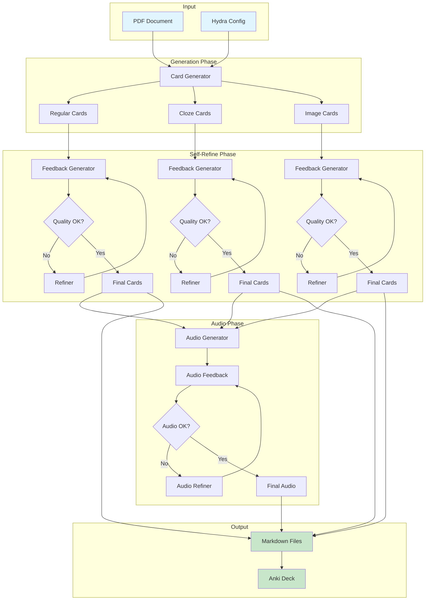
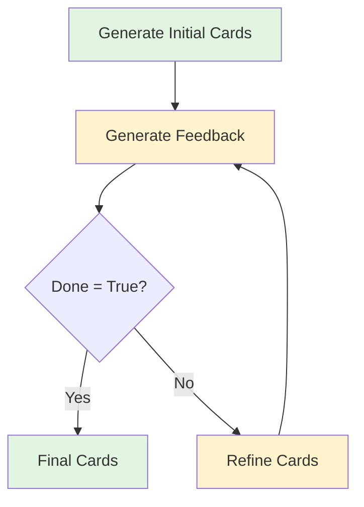
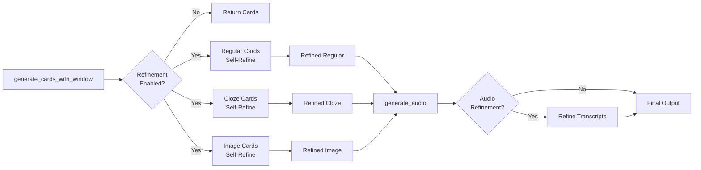
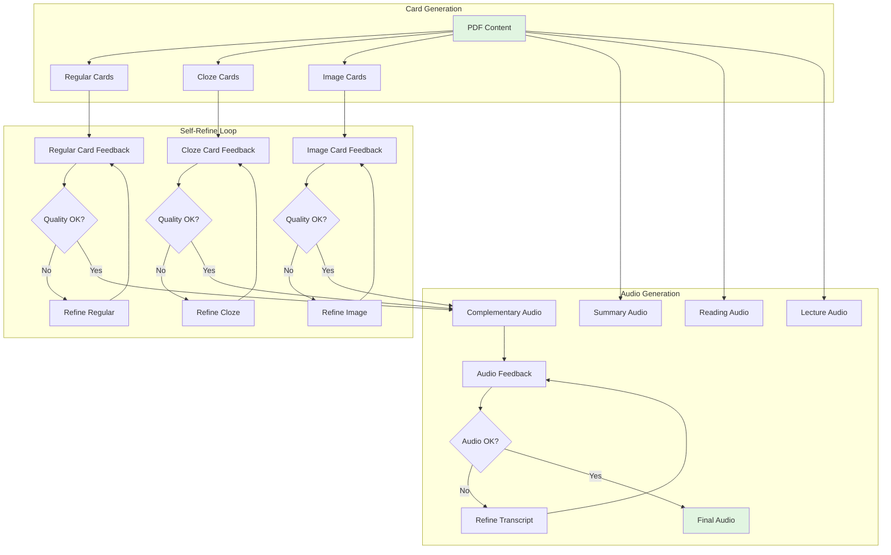

# Actor-Critic Refactor Plan for Swanki Pipeline

## Executive Summary

This document outlines the implementation of a Self-Refine system for Swanki that iteratively improves card quality through LLM-based feedback and refinement. The system addresses 9 categories of quality issues identified through user testing.

### Key Decisions

- **Pattern**: Self-Refine (not Self-Verification) for iterative improvement
- **Default**: Refinement OFF to maintain backward compatibility  
- **Configuration**: Fully configurable via Hydra configs
- **Scope**: Covers all content types (regular/cloze/image cards, all audio types)

### Quick Start (After Implementation)

```bash
# Default (no refinement)
swanki pdf_path=paper.pdf

# Enable refinement
swanki pdf_path=paper.pdf refinement=strict

# Custom refinement
swanki pdf_path=paper.pdf refinement.enabled=true refinement.max_iterations=2
```

## Overview

This plan implements an LLM-based quality improvement system using Instructor's Self-Refine pattern. The system iteratively refines generated content based on structured feedback, replacing rigid regex validation with intelligent critique and improvement.

## Card Quality Issues Identified

Based on user feedback and testing, the following card quality issues have been identified:

### 1. External References

- Cards contain references like "[1]", "[12]", "According to Smith et al."
- References to figures/tables: "As shown in Figure 3"
- Author-centric questions: "What is Lachapelle et al.'s method?"

### 2. Insufficient Context

- Vague phrases: "this framework", "the model", "this approach"
- Missing definitions for variables: h(W), g_j, f_j
- Cards assume access to external content

### 3. Generic Tags

- Using tags like #equation, #formula, #definition
- Should use conceptual tags: #causal-inference.dag

### 4. Rote Memorization

- Simple acronym expansion: "What does SEM stand for?"
- Should ask what SEM IS or HOW it works

### 5. Mathematical Issues

- Undefined symbols in equations
- Math notation outside cloze markers in cloze cards
- Poor LaTeX to speech conversion

### 6. Cloze Card Problems

- Multiple cloze deletions making cards too difficult
- Math equations split across cloze markers
- Entire equations hidden instead of parts

### 7. Image Card Issues

- Image summaries giving away answers
- Poor question quality for visual content
- Math notation not humanized in audio

### 8. Audio Generation Problems

- Complementary audio cut off
- Citation key errors propagating to all cards
- Poor math notation pronunciation

### 9. Undefined Acronyms

- Using NAS, DAG, etc. without expansion
- Not providing full forms on first use

## System Architecture Overview



## Self-Refine Architecture (Using Instructor)

### Components

1. **Generator** (Initial Response)
   - Current LLM-based card generation
   - Produces initial cards using CardGenerationResponse model

2. **Feedback Generator** (Critic)
   - Uses same LLM to evaluate card quality
   - Returns structured feedback with specific issues
   - Indicates if refinement is needed with `done` flag

3. **Refiner** (Same LLM)
   - Takes original cards + feedback
   - Generates improved cards addressing feedback
   - Returns refined CardGenerationResponse

### Flow (Self-Refine Pattern)

The Self-Refine flow follows this iterative pattern:



Key Points:

- Single LLM handles all steps
- Clear stopping condition (done flag)
- History tracking for debugging
- Maximum iteration limit as safety

## Implementation Plan

### Phase 1: Self-Refine Models with Instructor

1. **Define Feedback Model**

   ```python
   from pydantic import BaseModel, Field
   from typing import Literal
   
   class CardFeedback(BaseModel):
       """Structured feedback for card quality issues."""
       feedback: List[str] = Field(
           description="List of specific issues to fix in the cards"
       )
       done: bool = Field(
           description="True if cards meet quality standards, False if refinement needed"
       )
       
   class CardIssue(BaseModel):
       """Individual issue found in a card."""
       card_index: int
       issue_type: Literal[
           "external_reference", "insufficient_context", "generic_tags",
           "rote_memorization", "math_formatting", "cloze_problem",
           "undefined_acronym", "author_centric"
       ]
       description: str
       example: str = Field(description="Example from the card showing the issue")
       suggestion: str = Field(description="How to fix this issue")
   ```

2. **Enhanced CardGenerationResponse**

   ```python
   class CardGenerationResponse(BaseModel):
       """Response with quality tracking."""
       cards: List[PlainCard]
       skipped_sections: List[str] = Field(default_factory=list)
       quality_score: Optional[float] = Field(
           None, description="Self-assessed quality score 0-1"
       )
       iteration: Optional[int] = Field(
           None, description="Refinement iteration number"
       )
   ```

### Phase 2: Content-Specific Requirements

Based on the extensive prompts in `generator.py`, each content type has specific requirements:

#### 1. Regular Card Requirements

- ✅ Self-contained questions with complete context
- ❌ No external references ([1], "According to X", "Figure 3")
- ❌ No vague phrases ("this framework", "the model")
- ✅ Specific conceptual tags (#optimization.gradient-descent)
- ✅ Mathematical symbols defined ("where h is a smooth function")
- ✅ Concept-focused, not author-focused

#### 2. Cloze Card Requirements

- ✅ Maximum 2 cloze deletions per card
- ✅ Entire equations inside cloze markers when referenced
- ❌ No split math expressions across cloze boundaries
- ✅ Test understanding, not memorization
- ✅ Include tags just like regular cards
- Example: `The equation {{c1::\\(E = mc^2\\)}} demonstrates...`

#### 3. Image Card Requirements

- ✅ Questions test understanding of visual content
- ❌ Image summary must not reveal the answer
- ✅ Reference "the image" or "this figure" naturally
- ✅ No image markdown in text (handled separately)
- ✅ Respect placement strategy (front/back/smart)

#### 4. Audio Generation Requirements

**Complementary Audio (Card Audio):**

- Convert math notation to natural language
- Expand acronyms on first use
- Pronounce citation key correctly
- For cloze cards: say "blank" for hidden content
- Include image summaries when cards have images

**Summary Audio:**

- Professional, informative tone
- Focus on key contributions and findings
- Natural mention of citation key

**Reading Audio:**

- Full document narration
- Math notation humanized
- Clear pronunciation of technical terms

**Lecture Audio:**

- Educational presentation style
- Direct start without lengthy intro
- Avoid theatrical language

### Phase 3: Configurable Refinement System

Add a new `refinement` config group to the Hydra structure:

```yaml
# In .swanki_config/refinement/default.yaml
refinement:
  enabled: false  # Off by default to maintain backward compatibility
  max_iterations: 3
  
  # Feedback prompts for different content types
  feedback_prompts:
    regular_cards: |
      Check these regular cards for quality issues:
      1. External references ([1], "According to X", "Figure 3")
      2. Vague context ("this framework", "the model")
      3. Generic tags (#equation vs #calculus.derivatives)
      4. Author-centric questions ("What is Smith's method?")
      5. Undefined mathematical symbols
      6. Rote memorization questions
      
      If ALL cards meet quality standards, set done=True.
      Otherwise list specific issues with card numbers.
    
    cloze_cards: |
      Check these cloze cards for issues:
      1. More than 2 cloze deletions per card
      2. Math equations split across cloze markers
      3. Entire equations not inside cloze when referenced
      4. Testing memorization instead of understanding
      5. Missing or generic tags
      
      Example of correct math cloze:
      "The equation {{c1::\\(E = mc^2\\)}} shows..."
      
      If ALL cards are correct, set done=True.
    
    image_cards: |
      Check these image-based cards:
      1. Questions that just ask to describe the image
      2. Image summaries that give away the answer
      3. Image markdown included in text
      4. Not testing understanding of concepts
      
      Good questions test WHY/HOW, not just WHAT is shown.
      If ALL cards meet standards, set done=True.
    
    audio_transcript: |
      Check this audio transcript for:
      1. Math notation not converted to natural language
      2. Unexpanded acronyms
      3. Missing or mispronounced citation key
      4. For cloze: hidden content not replaced with "blank"
      5. Technical terms without pronunciation guides
      
      If transcript is clear for audio, set done=True.
  
  # Refinement prompts for fixing issues
  refinement_prompts:
    regular_cards: |
      Fix ALL the issues identified in the feedback.
      Maintain the same number of cards.
      Ensure every card is self-contained.
      Use specific conceptual tags.
    
    cloze_cards: |
      Fix ALL cloze card issues:
      - Reduce to max 2 cloze deletions
      - Keep math equations together
      - Ensure understanding-based questions
      - Add proper hierarchical tags
    
    image_cards: |
      Improve image cards to:
      - Test conceptual understanding
      - Avoid revealing answers in summaries
      - Remove any image markdown
      - Focus on WHY/HOW questions
    
    audio_transcript: |
      Rewrite for clear audio:
      - Convert all math to words
      - Expand all acronyms
      - Add pronunciation guides
      - Replace cloze with "blank"
```

```yaml
# In .swanki_config/refinement/strict.yaml
refinement:
  enabled: true
  max_iterations: 5  # More iterations for higher quality
  early_exit_on_quality: 0.9  # Exit early if quality score is high
  
  feedback_prompts:
    # More detailed checking prompts...
```

```yaml
# In .swanki_config/config.yaml (add to defaults)
defaults:
  - _self_
  - pipeline: default
  - prompts: default
  - models: default
  - audio: default
  - output: default
  - anki: default
  - refinement: default  # Add this line
```

### Phase 4: Pipeline Integration with Self-Refine

#### Integration Points in Existing Pipeline

The self-refine system integrates at these key points:



1. **Implement Self-Refine in Pipeline**

   ```python
   def generate_cards_with_self_refine(self, content, doc_summary, num_cards, num_cloze):
       """Generate cards using self-refine pattern."""
       
       # Step 1: Generate initial cards
       response = self._generate_initial_cards(
           content, doc_summary, num_cards, num_cloze
       )
       
       # Step 2: Self-refine loop
       history = []
       max_iterations = self.config.get("critics", {}).get("max_iterations", 3)
       
       while len(history) < max_iterations:
           # Generate feedback
           feedback = self._generate_feedback(response, doc_summary)
           
           # Check stopping condition
           if feedback.done:
               break
               
           # Refine cards based on feedback
           refined_response = self._refine_cards(
               response, feedback, doc_summary
           )
           
           # Save to history
           history.append({
               "iteration": len(history),
               "cards": response.cards,
               "feedback": feedback.feedback,
               "refined": refined_response.cards
           })
           
           response = refined_response
       
       return response
   ```

2. **Feedback Generation Method**

   ```python
   def _generate_feedback(self, response: CardGenerationResponse, doc_summary: DocumentSummary) -> CardFeedback:
       """Generate quality feedback for cards."""
       
       # Format cards for evaluation
       cards_text = self._format_cards_for_feedback(response.cards)
       
       feedback_prompt = self.config.get("critics", {}).get("feedback_prompt", "")
       
       return self.instructor.chat.completions.create(
           model=self.llm_model,
           response_model=CardFeedback,
           messages=[
               {
                   "role": "system",
                   "content": """You are an expert flashcard quality evaluator.
                   Check for these issues:
                   1. External references ([1], "According to X")
                   2. Insufficient context ("this", "the model")
                   3. Generic tags (#equation vs #calculus.derivatives)
                   4. Rote memorization ("What does X stand for?")
                   5. Math formatting issues
                   6. Cloze problems (multiple deletions, split equations)
                   7. Undefined acronyms
                   8. Author-centric questions
                   
                   If ALL cards are high quality, set done=True.
                   Otherwise provide specific, actionable feedback."""
               },
               {
                   "role": "user",
                   "content": f"""
                   Document context:
                   Title: {doc_summary.title}
                   Acronyms: {doc_summary.acronyms}
                   
                   Cards to evaluate:
                   {cards_text}
                   
                   {feedback_prompt}
                   """
               }
           ]
       )
   ```

3. **Card Refinement Method**

   ```python
   def _refine_cards(self, response: CardGenerationResponse, 
                     feedback: CardFeedback, 
                     doc_summary: DocumentSummary) -> CardGenerationResponse:
       """Refine cards based on feedback."""
       
       cards_text = self._format_cards_for_feedback(response.cards)
       feedback_text = "\n".join([f"- {f}" for f in feedback.feedback])
       
       return self.instructor.chat.completions.create(
           model=self.llm_model,
           response_model=CardGenerationResponse,
           messages=[
               {
                   "role": "system",
                   "content": """You are an expert flashcard creator.
                   Refine the cards to address ALL feedback issues.
                   Maintain the same number and types of cards."""
               },
               {
                   "role": "user",
                   "content": f"""
                   Original cards:
                   {cards_text}
                   
                   Feedback to address:
                   {feedback_text}
                   
                   Document context:
                   Title: {doc_summary.title}
                   Acronyms: {doc_summary.acronyms}
                   Technical terms: {doc_summary.technical_terms}
                   
                   Generate {len(response.cards)} improved cards addressing all feedback.
                   """
               }
           ]
       )
   ```

### Phase 5: Specialized Self-Refine Configurations

1. **Quick Validation Mode**

   ```python
   # Fast feedback with binary pass/fail
   feedback_prompt = "List critical issues only. Set done=True if acceptable."
   max_iterations = 1
   ```

2. **Deep Refinement Mode**

   ```python
   # Detailed feedback with multiple iterations
   feedback_prompt = """Provide detailed feedback on:
   - Content accuracy and completeness
   - Question clarity and self-containment  
   - Tag specificity and hierarchy
   - Mathematical notation correctness"""
   max_iterations = 3
   ```

3. **Domain-Specific Mode**

   ```python
   # Custom feedback for specific domains
   medical_prompt = "Also check: medical terminology, clinical accuracy, ethical considerations"
   math_prompt = "Focus on: proof structure, notation consistency, conceptual clarity"
   ```

### Phase 6: Performance Optimization

1. **Batch Processing**
   - Evaluate multiple cards in single API call
   - Reduces token usage and latency

2. **Caching**
   - Cache critic responses for similar content
   - Reuse feedback patterns

3. **Progressive Enhancement**
   - Start with fast, simple critics
   - Apply expensive critics only when needed

4. **Early Exit**
   - Skip critics for high-confidence generations
   - User-configurable confidence thresholds

## Configuration Examples

### Minimal Token Usage (Quick Check)

```yaml
critics:
  enabled: true
  max_iterations: 1
  feedback_prompt: "List only critical issues (external refs, undefined terms)."
  refinement_prompt: "Fix only the critical issues listed."
  stop_on_acceptable: true  # Don't refine if quality is "acceptable"
```

### Maximum Quality (Full Self-Refine)

```yaml
critics:
  enabled: true
  max_iterations: 3
  feedback_prompt: |
    Evaluate cards for ALL quality criteria:
    1. No external references or figure mentions
    2. Complete self-contained context
    3. Specific conceptual tags (not generic)
    4. Testing understanding (not memorization)
    5. Proper math formatting and cloze usage
    6. All acronyms defined on first use
    7. Concept-focused (not author-focused)
    
    Provide specific examples and fixes for each issue.
  refinement_prompt: |
    Address ALL feedback. Ensure:
    - Every card is completely self-contained
    - Mathematical notation is clear and well-defined
    - Tags are specific and hierarchical
    - Questions test deep understanding
```

### Domain-Specific Configuration

```yaml
critics:
  enabled: true
  max_iterations: 2
  domain: "medical"
  feedback_prompt: |
    Standard quality checks PLUS:
    - Medical terminology accuracy
    - Clinical relevance
    - Patient safety considerations
    - Evidence-based content
  refinement_prompt: |
    Fix all issues while maintaining medical accuracy.
    Use standard medical terminology with lay explanations.
```

## Token Usage Estimates

- Validation Only: ~100-200 tokens per card
- With Refinement: ~300-500 tokens per card
- Full Rewriting: ~500-1000 tokens per card

## Implementation Timeline

1. **Week 1**: Basic critic infrastructure and models
2. **Week 2**: General and cloze critics
3. **Week 3**: Image and audio critics
4. **Week 4**: Configuration system and pipeline integration
5. **Week 5**: Performance optimization and caching
6. **Week 6**: Testing and refinement

## Benefits

1. **Quality**: Consistent high-quality cards
2. **Flexibility**: Easily add new quality criteria
3. **Configurability**: Users control quality vs. cost tradeoff
4. **Extensibility**: Domain-specific critics
5. **Transparency**: Clear feedback on why cards failed

## Choosing the Right Instructor Pattern

### Why Self-Refine Over Self-Verification

While Instructor offers both Self-Refine and Self-Verification patterns, **Self-Refine** is better suited for our card quality improvement needs:

**Self-Verification** (from `self_verification.md`):

- Generates multiple candidates then verifies them
- Uses declarative rewriting and True/False verification
- Better for factual correctness than quality improvement
- Higher token usage (n candidates × k verifications)

**Self-Refine** (Chosen Approach):

- Single candidate with iterative improvement
- Direct feedback on quality issues
- Lower token usage
- Better for stylistic and structural improvements

## Complete Self-Refine Example from Instructor Docs

Here's the complete pattern from the Instructor documentation that we'll adapt for card generation:

```python
import instructor
from pydantic import BaseModel, Field
from openai import OpenAI
from typing import Optional


class Response(BaseModel):
    code: str


class Feedback(BaseModel):
    feedback: list[str] = Field(
        description="A list of actions to take to improve the code."
    )
    done: bool


class Timestep(BaseModel):
    response: str
    feedback: Optional[list[str]] = Field(default_factory=list)
    refined_response: Optional[str] = Field(default="")


class History(BaseModel):
    history: list[Timestep] = Field(default_factory=list)

    def add(self, code, feedback, refined_code):
        self.history.append(
            Timestep(response=code, feedback=feedback, refined_response=refined_code)
        )


client = instructor.from_openai(OpenAI())


def generate_feedback(response):
    return client.chat.completions.create(
        model="gpt-4o",
        response_model=Feedback,
        messages=[
            {
                "role": "user",
                "content": f"""
                        You are an expert Python coder.
                        Provide feedback on this code.
                        How can we make it (1) faster and (2) more readable?

                        <code>
                        {response.code}
                        </code>

                        If the code does not need to be improved, then indicate by setting "done" to True.
                        """,
            }
        ],
    )


def refine(response, feedback):
    return client.chat.completions.create(
        model="gpt-4o",
        response_model=Response,
        messages=[
            {
                "role": "user",
                "content": f"""
                        You are an expert Python coder.

                        <response>
                        {response.code}
                        </response>

                        <feedback>
                        {feedback.feedback}
                        </feedback>

                        Refine your response.
                        """,
            }
        ],
    )


def stop_condition(feedback, history):
    return feedback.done or len(history.history) >= 3


if __name__ == "__main__":
    response = client.chat.completions.create(
        model="gpt-4o",
        response_model=Response,
        messages=[
            {
                "role": "user",
                "content": "Write Python code to calculate the fibonacci sequence.",
            }
        ],
    )

    history = History()

    while True:
        feedback = generate_feedback(response)
        if stop_condition(feedback, history):
            break
        refined_response = refine(response, feedback)

        # Save to history
        history.add(response.code, feedback.feedback, refined_response.code)
        response = refined_response
```

## Adapting Self-Refine for Swanki Card Generation

The key adaptations for our use case:

1. **Response Model**: Instead of `Response(code: str)`, we use `CardGenerationResponse(cards: List[PlainCard])`
2. **Feedback Focus**: Instead of code optimization, we check for card quality issues
3. **History Tracking**: Track card refinements instead of code refinements
4. **Stopping Condition**: `done=True` when all cards meet quality standards

### Swanki-Specific Implementation

```python
# Models for card self-refine
class CardHistory(BaseModel):
    """Track refinement history for cards."""
    history: List[CardTimestep] = Field(default_factory=list)
    
    def add(self, cards, feedback, refined_cards):
        self.history.append(
            CardTimestep(
                cards=cards,
                feedback=feedback,
                refined_cards=refined_cards
            )
        )


class CardTimestep(BaseModel):
    """Single refinement iteration."""
    cards: List[PlainCard]
    feedback: List[str] = Field(default_factory=list)
    refined_cards: Optional[List[PlainCard]] = None


# In pipeline.py - integrate self-refine into existing flow
def generate_cards_with_window(self, ...):
    """Generate cards using sliding window with self-refine."""
    
    # Existing card generation logic...
    
    # Add self-refine if enabled
    if self.config.get("critics", {}).get("enabled", False):
        # Use existing instructor client
        regular_response = self._self_refine_cards(
            regular_response, 
            doc_summary,
            card_type="regular"
        )
        
        cloze_response = self._self_refine_cards(
            cloze_response,
            doc_summary, 
            card_type="cloze"
        )
    
    # Continue with existing logic...
```

## Benefits of Self-Refine Approach

1. **Simplicity**: Single LLM handles generation, feedback, and refinement
2. **Flexibility**: Easy to adjust feedback criteria via prompts
3. **Transparency**: Clear feedback explains why cards need improvement
4. **Efficiency**: Batch processing and early stopping reduce API calls
5. **Integration**: Works seamlessly with existing instructor setup

## Content Type Processing Flow



## How Self-Refine Addresses Each Issue

| Issue | Detection in Feedback | Fix in Refinement |
|-------|----------------------|-------------------|
| External References `[1]` | Regex pattern match + LLM detection | Replace with actual content description |
| Vague Context | Check for "this/the" without antecedent | Add specific framework/model names |
| Generic Tags | Match against forbidden tag list | Suggest hierarchical conceptual tags |
| Rote Memorization | Detect "What does X stand for?" | Transform to "How does X work?" |
| Math Issues | Validate cloze syntax with math | Fix equation placement in cloze |
| Multiple Cloze | Count {{c\d::}} occurrences | Merge or reduce to max 2 |
| Image Problems | Analyze Q&A overlap | Rewrite to test understanding |
| Audio Issues | Check math conversion | Humanize notation |
| Undefined Acronyms | Match against doc_summary.acronyms | Expand on first use |

## Implementation Phases

### Phase 1: Core Self-Refine Infrastructure

1. Add feedback models to `models/cards.py`:
   - `CardFeedback` for general feedback
   - `ContentSpecificFeedback` for different card types
   - `AudioTranscriptFeedback` for audio quality

2. Create refinement config structure:
   - Add `.swanki_config/refinement/` directory
   - Create `default.yaml`, `strict.yaml`, `minimal.yaml`
   - Update main `config.yaml` to include refinement

### Phase 2: Content-Specific Implementation

3. Implement feedback generators in `pipeline.py`:

   ```python
   def _generate_regular_card_feedback(self, cards, doc_summary)
   def _generate_cloze_card_feedback(self, cards, doc_summary)
   def _generate_image_card_feedback(self, cards, doc_summary)
   def _generate_audio_feedback(self, transcript, card_type)
   ```

4. Implement refinement methods:

   ```python
   def _refine_regular_cards(self, cards, feedback, doc_summary)
   def _refine_cloze_cards(self, cards, feedback, doc_summary)
   def _refine_image_cards(self, cards, feedback, doc_summary)
   def _refine_audio_transcript(self, transcript, feedback)
   ```

### Phase 3: Integration and Testing

5. Integrate into existing pipeline:
   - Add refinement step after initial generation
   - Make it configurable (on/off)
   - Preserve backward compatibility

6. Test with problematic examples:
   - Cards with `[1]` references
   - Vague "this framework" cards
   - Multi-cloze cards with math
   - Image cards that reveal answers

### Phase 4: Optimization

7. Add performance features:
   - Batch feedback for multiple cards
   - Cache common feedback patterns
   - Early exit on high quality
   - Parallel processing for different card types

## Configuration Examples for Users

### Basic Usage (Refinement Off by Default)

```bash
swanki pdf_path=paper.pdf  # Default behavior, no refinement
```

### Enable Refinement

```bash
# Use predefined refinement configs
swanki pdf_path=paper.pdf refinement=strict  # High quality mode
swanki pdf_path=paper.pdf refinement=minimal  # Quick validation only

# Or enable with defaults
swanki pdf_path=paper.pdf refinement.enabled=true
```

### Refinement for Specific Content Types

```bash
# Refine only regular cards
swanki pdf_path=paper.pdf refinement.enabled=true refinement.content_types=[regular]

# Refine cards and audio
swanki pdf_path=paper.pdf refinement.enabled=true refinement.include_audio=true
```

### Custom Domain Refinement

Users can create `.swanki_config/refinement/medical.yaml`:

```yaml
refinement:
  enabled: true
  max_iterations: 2
  
  feedback_prompts:
    regular_cards: |
      Standard quality checks PLUS:
      - Medical terminology must follow ICD-10/SNOMED standards
      - Drug names must include both generic and brand names
      - Dosages must include units and routes of administration
      - Clinical guidelines must reference current standards
      
      Set done=True only if ALL criteria are met.
  
  refinement_prompts:
    regular_cards: |
      Fix all issues while maintaining clinical accuracy.
      Use standard medical terminology.
      Include patient safety considerations.
```

Then use:

```bash
swanki pdf_path=medical_paper.pdf refinement=medical
```

## Testing Strategy

### Unit Tests for Refinement

```python
# tests/test_self_refine.py
def test_feedback_generation():
    """Test that feedback correctly identifies issues."""
    cards = [
        PlainCard(
            front=CardContent(text="What does the framework in [6] do?"),
            back=CardContent(text="It optimizes DAGs"),
            tags=["equation"]
        )
    ]
    
    feedback = pipeline._generate_feedback(cards, doc_summary)
    assert not feedback.done
    assert "external reference" in str(feedback.feedback)
    assert "generic tag" in str(feedback.feedback)

def test_refinement_fixes_issues():
    """Test that refinement addresses feedback."""
    # Test each issue type gets fixed
```

### Integration Tests

```python
def test_full_refinement_pipeline():
    """Test complete refinement flow."""
    # Load problematic PDF
    # Run with refinement enabled
    # Verify no quality issues in output
```

## Metrics and Monitoring

### Quality Metrics

- **Refinement Rate**: % of cards needing refinement
- **Issue Distribution**: Which issues are most common
- **Iteration Count**: Average iterations to quality
- **Token Usage**: Tokens per card with/without refinement

### Logging

```python
logger.info(f"Refinement: {len(cards)} cards, {iterations} iterations")
logger.debug(f"Issues found: {feedback.feedback}")
logger.info(f"Quality improved from {initial_score} to {final_score}")
```

## Migration Guide

### For Existing Users

1. **No Action Required**: Refinement is off by default
2. **To Enable**: Add `refinement.enabled=true` to commands
3. **To Customize**: Create refinement configs in `.swanki_config/refinement/`

### For Developers

1. **Backward Compatible**: All existing code continues to work
2. **New Models**: Import from `swanki.models.feedback`
3. **Config Updates**: Add refinement section to configs

## Future Enhancements

1. **Multi-Stage Refinement**: Different criteria at each stage
2. **Learning from Feedback**: Cache and reuse common fixes
3. **User Feedback Loop**: Allow users to provide quality feedback
4. **A/B Testing**: Compare refined vs unrefined card performance

## References

self verification docs: @/Users/michaelvolk/Documents/projects/instructor/docs/prompting/self_criticism/self_verification.md
