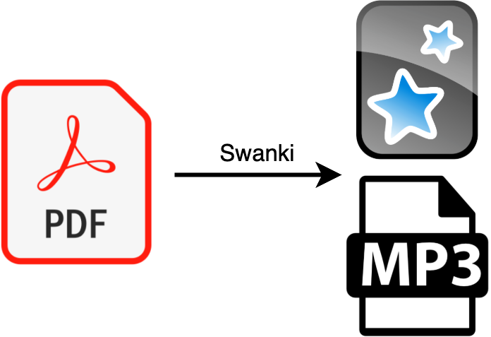

Michael Volk, Huimin Zhao

## ABSTRACT

![[paper.Abstract]]

## GRAPHICAL ABSTRACT

## INTRODUCTION

![[paper.Introduction]]

## METHODS

![[paper.Methods]]

## DISCUSSION

![[paper.Discussion]]

## ASSOCIATED CONTENT

The Supporting Information is available on the ACS Publications website at DOI: 10.1021/acs.jchemed.XXXXXXX. [ACS will fill this in.]

Example brief descriptions with file formats indicated are shown below; customize for your material.

Notes for Instructors (DOCX)
Survey Instrument (DOCX)

***

We provide links here to the source:

- [pypi-swanki](https://pypi.org/project/swanki)
- [github-Swanki](https://github.com/Mjvolk3/Swanki)
- [docs-swanki](https://swanki.readthedocs.io/en/latest/)

Open Source'd Swanki library on Zenodo.

## AUTHOR INFORMATION

Corresponding Author
*E-mail:

## REFERENCES
