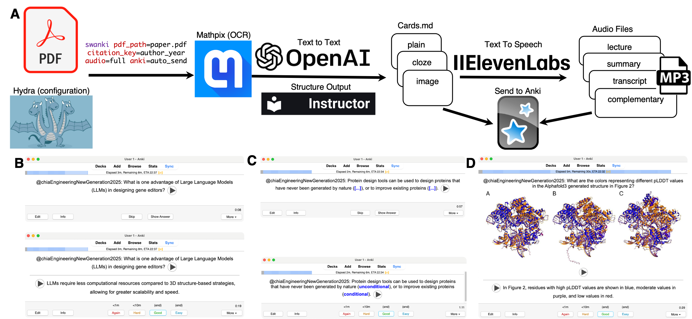

### Architecture

Swanki is implemented as a modular python application built on a pipeline-driven architecture that converts PDFs into Anki flashcards through sequential processing stages (Figure 1A). The core pipeline orchestrates PDF splitting using PyPDF2, OCR conversion via Mathpix API, and AI-powered content generation using OpenAI's GPT models with Instructor for enforcing structured outputs. The system employs a sliding window approach over the PDF with configurable window sizes to maintain contextual coherence and for guaranteeing full coverage during card generation. Pydantic data models used by Instructor ensure content validation and type safety throughout the processing workflow.

### Configuration

The software utilizes Hydra's hierarchical configuration system to provide comprehensive customization through automatically generated configuration files stored in `.swanki_config`. Users can modify processing parameters including window size, cards per page, image processing settings, and modify AI model prompts to their liking. The configuration system supports runtime overrides via command-line arguments and includes preset profiles (default, comprehensive, fast) for different use cases. Output files and Anki decks use citation keys so users can mix cards into large decks without losing context which supports elaborative encoding helping users relate their learnings across topics.

### Cards

The system generates three primary card types: standard question-answer cards (Figure 1A), cloze deletion cards that mask information (Figure 1B), and image-based cards derived from figures and diagrams (Figure 1C). Cards are tagged using configurable hierarchical systems with citation keys automatically prepended to maintain source attribution. LaTeX mathematical notation is preserved for visual display and converted to natural language for audio compatibility.

### Audio

Swanki's complementary audio system generates four distinct audio types: complementary audio providing front/back narration for each flashcard, summary audio for rapid content review, reading audio containing complete document narration, and lecture audio formatted as educational presentations. The system uses LLMs to convert academic text into transcripts for text-to-speech (TTS) models, automatically humanizing mathematical expressions and adding descriptions for images. Audio generation supports variable playback speeds, voice options, and other options configurable via the ElevenLabs API.

The audio system outputs enable different use cases. Lecture audio is good for first time listening and is similar to a solo podcast. Summaries can help for quick paper review, but are often difficult to digest with no previous familiarity with the PDF. Complete document narration can help serve as a pacer while reading and can help students from spending too much time reading instead of practicing via card review. Given a set amount of time, it is often a better use of time to reduce time spent reading and increase time being quizzed, that is reviewing cards. Lastly complementary card audio supports hands-free review sessions using gamepad controllers which can be easily setup with mobile devices with the Anki app. This can gamify the flashcard experience allowing users to participate in other activities like exercise as they listen to questions from the app and respond using small hand held controllers like the micro controller from 8BitDo.

**Figure 1.** Swanki pipeline and example outputs from an open source ACS publication @chiaEngineeringNewGeneration2025 . Play buttons on cards indicate that these cards were generated with complementary audio. Example cards are available on Github. (A) The Swanki pipeline starts with PDF input and the Hydra configuration from the user. A test default configuration is provided to users. Mathpix is then used for optical character recognition (OCR) converting the PDF to markdown and extracting images and equations. LLM's defaulting to using OpenAI API is then used with python library Instructor to create structured outputs improving the stability of the pipeline to create plain, cloze, and image cards. LLM and card outputs are then used to optionally construct lecture, summary, transcript, and complementary audio files. (B) Plain card example in the Anki App with the top image showing the front of the card and the bottom image showing the flipped card. (C) Cloze card example with the top image showing masked text and the bottom image showing flipped card revealing masked text. (D) Image card showing the flipped card.
