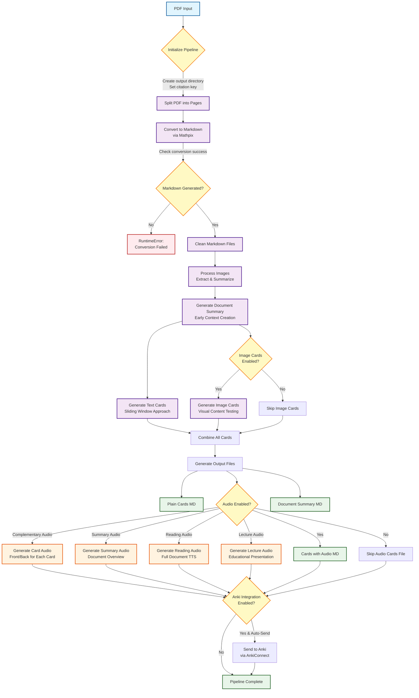
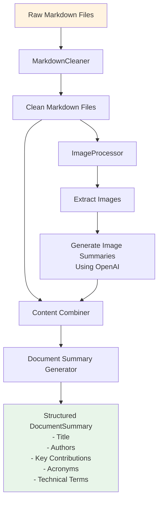
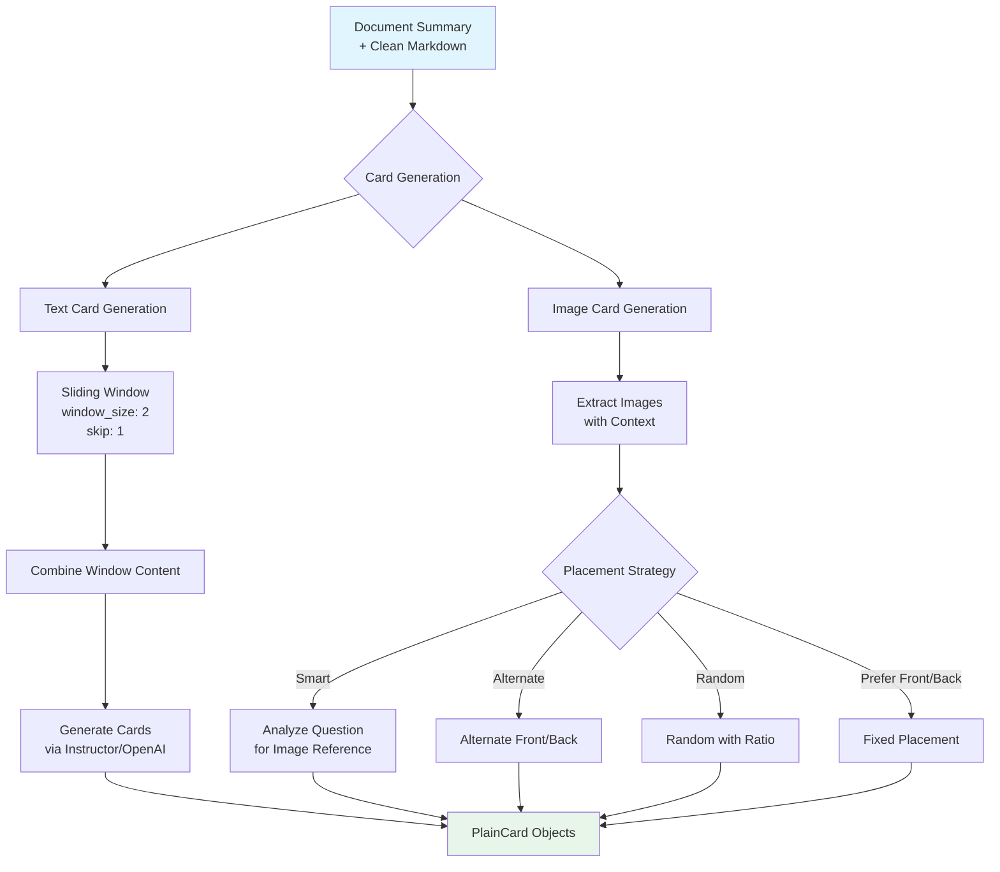
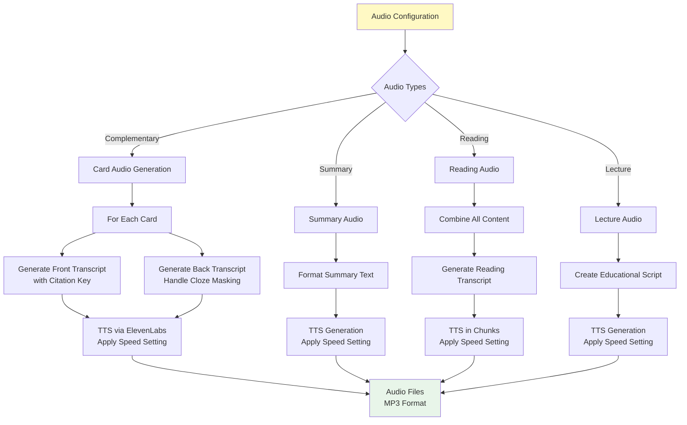
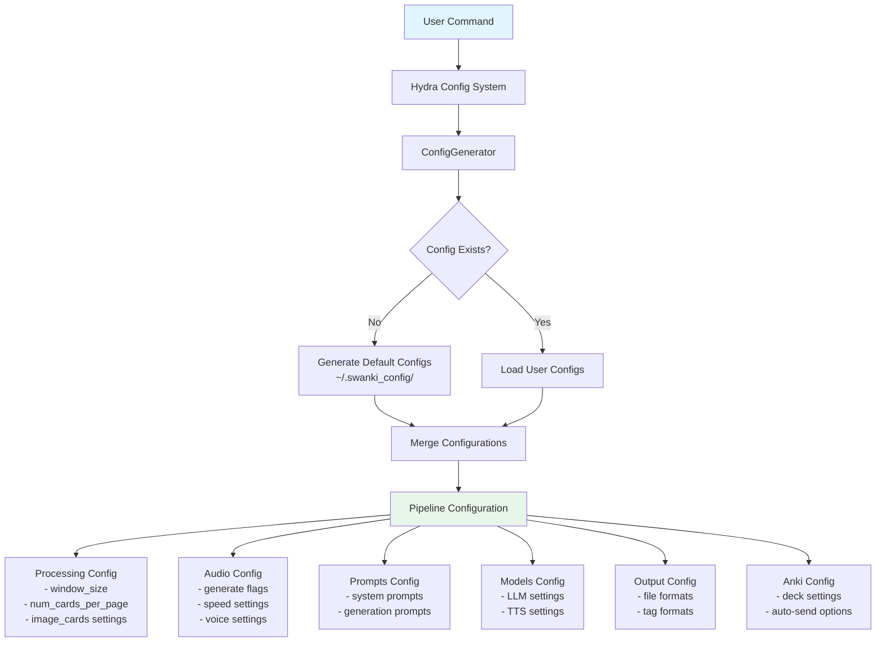
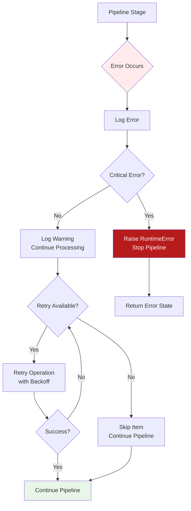
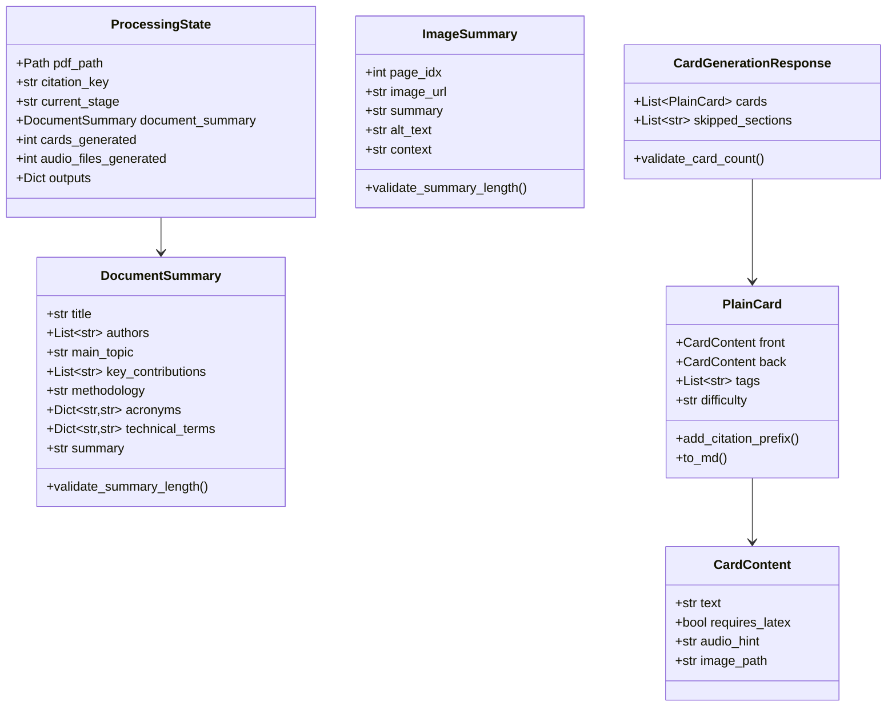

# Swanki Pipeline Architecture

## Overview

The Swanki pipeline orchestrates the complete process of converting academic PDFs into Anki flashcards with optional audio enhancement. The pipeline is configuration-driven using Hydra and supports various processing options and output formats.

## Main Pipeline Flow



## Detailed Component Breakdown

### 1. PDF Processing


### 2. Content Processing



### 3. Card Generation Pipeline



### 4. Audio Generation System



### 5. Anki Integration

```mermaid
graph TD
    A[Generated Cards] --> B{Anki Config}
    B --> C[Format Deck Name<br/>Template: {citation_key}]
    C --> D[Choose Card Format]
    D -->|Plain| E[Use cards-plain.md]
    D -->|With Audio| F[Use cards-with-audio.md]
    
    E --> G[Prepare Anki File<br/>Add Deck Header]
    F --> G
    
    G --> H[AnkiProcessor]
    H --> I[AnkiConnect API]
    I --> J{Actions}
    J --> K[Create/Select Deck]
    J --> L[Add/Update Cards]
    J --> M[Upload Media Files]
    J --> N[Sync Collection]
    
    K --> O[Success Response]
    L --> O
    M --> O
    N --> O
    
    style A fill:#e1f5fe
    style O fill:#e8f5e9
```

## Configuration Flow



## Error Handling Flow



## Data Models



## Key Features

1. **Configuration-Driven**: All aspects controlled via Hydra configs
2. **Sliding Window Processing**: Better context for card generation
3. **Early Summary Generation**: Provides context for all downstream processing
4. **Flexible Audio Options**: Multiple audio types with speed control
5. **Smart Image Card Generation**: Various placement strategies
6. **Robust Error Handling**: Graceful degradation and recovery
7. **Anki Integration**: Direct upload via AnkiConnect

## Usage Examples

### Basic Pipeline
```bash
swanki --pdf_path=paper.pdf --citation_key=Smith2023
```

### With Custom Output Directory
```bash
swanki --pdf_path=paper.pdf --citation_key=Smith2023 +output_dir=chapter1
```

### Full Audio Generation
```bash
swanki --pdf_path=paper.pdf --citation_key=Smith2023 \
       audio.audio.generate_complementary=true \
       audio.audio.generate_summary=true \
       audio.audio.generate_reading=true \
       audio.audio.generate_lecture=true
```

### Custom Processing Options
```bash
swanki --pdf_path=paper.pdf --citation_key=Smith2023 \
       pipeline.processing.window_size=3 \
       pipeline.processing.num_cards_per_page=5 \
       audio.audio.complementary_speed=1.6
```