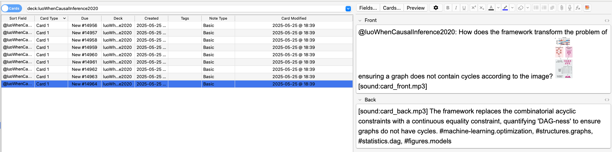
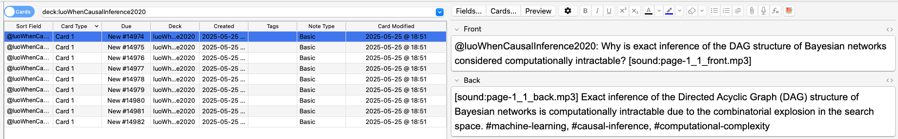
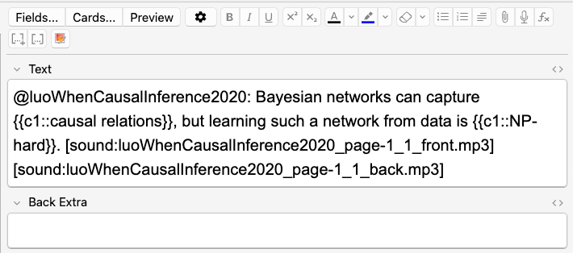

## 2025.05.23

- [x] Claude refactor for more reliable output

## 2025.05.27

## 2025.05.29

**Issue**

The audio for this cards reads like this.
What does the images equation X equals I W top maps to X equals f two I W top minus one f one Z represent. Major issues are that it forgot the minus sign and it should read minus one as inverse. The math should read like this. "X equals I minus W transpose maps to X equals f two of the inverse of I minus W transpose times f one of Z."

**Issue**

@chiaEngineeringNewGeneration2025: ## What technological advancement has revolutionized biology by enabling precise DNA and RNA edits?

## 2025.05.31

**Issue**

I don't think it is possible to make Latex table $/tabular$ we should probably prompt to not make tables
